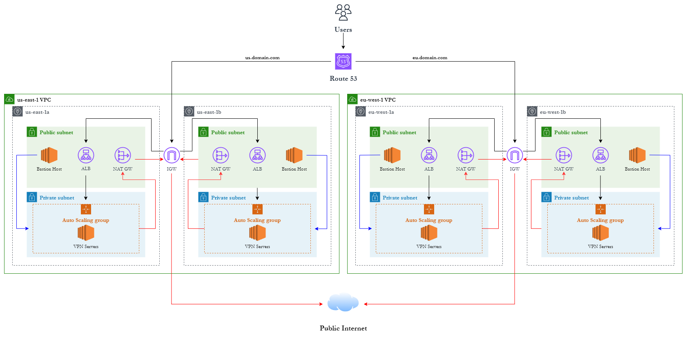

# VPN-Service-Project

## Baseline Architecture

Architecture Diagram Issues:
- An auto-scaling group can span multiple AZs, so need to edit diagram accordingly

Architecture Logic that I need to implement after settling current issues:

- OpenVPN will need to have a centralised authentication system. I need to implement regional Microsoft AD for both VPCs
- Have to look into whether ALB is suitable for stateful VPN connections
- Logic for OpenVPN auto-scaling is sparse, have to look into whether the servers operate seperately or whether its smth like a cluster in which more servers are added to
- Need to set sticky sessions on the load balancer
- Still unsure of Route53 suitability to deliver the users to the correct infrastructure
- Client applications (Mobile -> Flutter, Desktop -> ???) need to be looked into, no clue what to use to develop the Desktop application due to lack of experience

Current Issues im facing now:

- Need to configure ansible dynamic inventory to use my bastion/jump host to configure private instances
- Need to set bastion/jump host to mantain and apply server configurations on scaling up policies (We can look into SNS or some CRON thingy)
- When ansible works, have to fix up gitlab pipeline
- Continue development of the terraform baseline architecture before tackling the bigger fishes aforementioned above
- Still hv to decide whether 2 environments (dev & prod) wld benefit the project
- Look into Jira for project development??? Random idea
